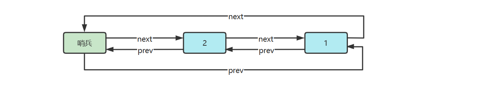

# 02 链表

## 2.1 概述

**定义**

链表是数据元素的线性集合，其每个元素都指向下一个元素，元素存储上并不连续（区别于元素连续存储的数组）

**分类**

- 单向链表，每个元素只知道其下一个元素是谁
- 双向链表，每个元素知道其上一个元素和下一个元素
- 循环链表，循环链表的 tail 指向的是头节点 head

还有一种特殊的节点称为哨兵（Sentinel）节点，也叫做哑元（Dummy）节点，它不存储数据，通常用作头尾，用来简化边界判断

**随机访问性能**

根据 index 查找，时间复杂度 $O(n)$ 【区别于数组 $O(1)$】

**插入或删除性能**

* 起始位置：$O(1)$
* 结束位置：如果已知 tail 尾节点是 $O(1)$，不知道 tail 尾节点是 $O(n)$
* 中间位置：根据 index 查找时间 + $O(1)$
* 【数组无论什么位置都是 $O(n)$】

## 2.2 单向链表

```python
# 节点类Node
class Node:
    def __init__(self, value, next):
        self.value = value
        self.next = next
```

添加【头、尾、普遍】、删【头、普遍】、根据索引获取、遍历

```python
# 单向链表
class LinkedList:
    def __init__(self, head=None):
        self.head = head

    # 头插
    def add_first(self, value):
        # 1.链表为空
        # self.head = Node(value, None)
        # 2.链表非空
        self.head = Node(value, self.head)
    
    # 获取尾节点
    def find_last(self):
        if self.head is None:  # 防止none.next空指针报错
            return None
        else:
            cur = self.head
            while cur.next:
                cur = cur.next
            return cur
    # 尾插
    def add_last(self, value):
        last = self.find_last()
        if last is None:  # 空链表的情况尾插与头插相同
            self.add_first(value)
        else:
            last.next = Node(value, None)
    
    # 普遍的插入
    def insert(self, index, value):
        if index == 0:
            self.add_first(value)
        else:
            pre = self.find_node(index - 1)  # 找到上一个节点
            if pre is None:  # 找不到说明index越界
                return 'LinkedList index out of range'
            else:
                pre.next = Node(value, pre.next)
    
    # 普通遍历  
    def loop(self):
        cur = self.head
        while cur:
            print(cur.value)
            cur = cur.next

    # 递归遍历
    def recursive_loop(self):
        self.recursion(self.head)
    def recursion(self, cur):
        if cur is None:
            return
        print('before:', cur.value)
        self.recursion(cur.next)
        print('after:', cur.value)

    # 根据索引获取节点及其值
    def find_node(self, index):
        i = 0
        cur = self.head
        while cur:
            if i == index:
                return cur
            cur = cur.next
            i += 1
        return None
    def get(self, index):
        node = self.find_node(index)
        if node:
            return node.value
        else:
            return 'LinkedList index out of range'

    # 头删
    def remove_first(self):
        if not self.head:
            return 'LinkedList is empty'
        else:
            self.head = self.head.next
    
    # 根据索引删除
    def remove(self, index):
        if index == 0:
            self.remove_first()
        else:
            pre = self.find_node(index - 1)  # 上一个节点
            if pre is None:
                return 'LinkedList index out of range'
            remove = pre.next  # 被删除的节点
            if remove is None:  # 找到index的上一个节点(已经在链表尾了)但未找到需要删除的节点
                return 'LinkedList index out of range'
            pre.next = remove.next
```


## 2.3 单向链表（带哨兵）

不带哨兵的单向链表的方法几乎都要判断 head，因此使用一个不参与数据存储的特殊 Node 作为哨兵【具体存什么值无所谓，因为不会用到它的值】

- 在 find_node 中将 i 初始值设置为 -1 对应哨兵，实际传入的需要寻找的 index 还是 $[0, \infty)$【不会去找 index 为 -1】
- find_last 绝不会返回 null 了，就算没有其它节点，也会返回哨兵作为最后一个节点，并且可以用 add_last 成功进行尾插
- 对于 remove 来说，由于需要被删节点及其前一个节点，现在有了哨兵就不需要特判 remove_first 了

```python
class LinkedListSentinel:
    def __init__(self):
        self.head = Node(666, None)

    # 获取尾节点
    def find_last(self):
        cur = self.head
        while cur.next:
            cur = cur.next
        return cur
    # 尾插
    def add_last(self, value):
        last = self.find_last()
        last.next = Node(value, None)
    
    # 普遍的插入(此时不再需要单独的头插)
    def insert(self, index, value):
        pre = self.find_node(index - 1)  # 找到上一个节点
        if pre is None:  # 找不到说明index越界
            return 'LinkedList index out of range'
        else:
            pre.next = Node(value, pre.next)
    
    # 普通遍历  
    def loop(self):
        cur = self.head.next  # 带哨兵时遍历起点变了
        while cur:
            print(cur.value)
            cur = cur.next

    # 根据索引获取节点及其值
    def find_node(self, index):
        i = -1  # 哨兵的index为-1
        cur = self.head
        while cur:
            if i == index:
                return cur
            cur = cur.next
            i += 1
        return None
    def get(self, index):
        node = self.find_node(index)
        if node:
            return node.value
        else:
            return 'LinkedList index out of range'

    # 根据索引删除(此时不再需要单独的头删)
    def remove(self, index):
        pre = self.find_node(index - 1)  # 上一个节点
        if pre is None:
            return 'LinkedList index out of range'
        remove = pre.next  # 被删除的节点
        if remove is None:  # 找到index的上一个节点(已经在链表尾了)但未找到需要删除的节点
            return 'LinkedList index out of range'
        pre.next = remove.next
```


## 2.4 双向链表（带哨兵）

- 在双向链表中，由于有了尾哨兵节点的辅助，在进行尾删和尾插时不需要遍历了，可以直接通过操作 tail 来实现

```python
class Node:
    def __init__(self, prev, value, next):
        self.value = value
        self.prev = prev
        self.next = next

class DoubleLinkedListSentinel:
    def __init__(self):
        # 两个哨兵
        self.head = Node(None, 666, None)
        self.tail = Node(None, 888, None)
        self.head.next = self.tail
        self.tail.prev = self.head
    
    # 根据索引获取节点的工具方法
    def find_node(self, index):
        i = -1
        cur = self.head
        while cur != self.tail:
            if i == index:
                return cur
            cur = cur.next
            i += 1
        return None
    
    # 插入
    def insert(self, index, value):
        prev = self.find_node(index - 1)  # 前一个节点
        if prev is None:
            raise Exception('LinkedList index out of range')
        else:
            next = prev.next  # 后一个节点
            node = Node(prev, value, next)  # 创建新节点和前后指针
            # 改变原先两个节点的前后指针
            next.prev = node
            prev.next = node

    # 删除
    def remove(self, index):
        prev = self.find_node(index - 1)  # 前一个节点
        if prev is None:
            raise Exception('LinkedList index out of range')
        node = prev.next  # 要删除的节点
        if node == self.tail:  # 尾哨兵不能删除
            raise Exception('LinkedList index out of range')
        next = node.next  # 后一个节点
        # 改变前后指针
        prev.next = next
        next.prev = prev
        
    # 由于有了尾哨兵，在进行尾插和尾删时不再需要遍历
    def add_last(self, value):
        prev = self.tail.prev
        node = Node(prev, value, self.tail)
        prev.next = node
        self.tail.prev = node
    def remove_last(self):
        remove = self.tail.prev
        # 要remove的节点不能是头哨兵
        if remove == self.head:
            raise Exception('No Enough Node in LinkedList')
        prev = remove.prev
        prev.next = self.tail
        self.tail.prev = prev
    
    # 遍历
    def loop(self):
        cur = self.head.next
        while cur != self.tail:
            print(cur.value)
            cur = cur.next
```


## 2.5 环形链表（带哨兵）


s <-> s


s <-> 1 <-> s



s <-> 2 <-> 1 <-> s


s <-> 2 <-> 1 <-> 3 <-> s

```python
class Node:
    def __init__(self, prev, value, next):
        self.value = value
        self.prev = prev
        self.next = next

class LinkedListCycleSentinel:
    def __init__(self):
        self.sentinel = Node(None, 666, None)
        # 初始化时哨兵节点的前后指针都指向自己
        self.sentinel.prev = self.sentinel
        self.sentinel.next = self.sentinel
    
    # 头插和尾插
    def add_first(self, value):
        a = self.sentinel
        b = self.sentinel.next
        node = Node(a, value, b)
        a.next = node
        b.prev = node
    def add_last(self, value):
        b = self.sentinel
        a = self.sentinel.prev  # 原来的最后一个节点
        node = Node(a, value, b)
        a.next = node
        b.prev = node
        
    # 头删和尾删
    def remove_first(self):
        remove = self.sentinel.next
        if remove == self.sentinel:
            raise Exception('No Enough Node in Cycled LinkedList')
        a = self.sentinel
        b = remove.next
        a.next = b
        b.prev = a
    def remove_last(self):
        remove = self.sentinel.prev
        if remove == self.sentinel:
            raise Exception('No Enough Node in Cycled LinkedList')
        a = remove.prev
        b = self.sentinel
        a.next = b
        b.prev = a
    
    # 找到值的对应节点的工具方法
    def find_by_value(self, value):
        p = self.sentinel.next
        while p != self.sentinel:
            if p.value == value:
                return p
            p = p.next
        return None
        
    # 根据值删除
    def remove_by_value(self, value):
        node = self.find_by_value(value)
        if node is None:
            raise Exception('Value Not Find')
        a = node.prev
        b = node.next
        a.next = b
        b.prev = a
    
    # 遍历(回到哨兵节点时停止)
    def loop(self):
        cur = self.sentinel.next
        while cur != self.sentinel:
            print(cur.value)
            cur = cur.next
```


## 练习

#### [206. 反转链表](https://leetcode.cn/problems/reverse-linked-list/)

- 构造一个新链表，从**旧链表**依次拿到每个节点，创建新节点添加至**新链表**头部

```python
class Solution:
    def reverseList(self, head: Optional[ListNode]) -> Optional[ListNode]:
        cur = head
        p = None
        while cur:
            p = ListNode(cur.val, p)
            cur = cur.next
        return p
```

- 构造一个新链表，从**旧链表头部**移除节点，添加到**新链表头部**

```python
class Solution:
    def reverseList(self, head: Optional[ListNode]) -> Optional[ListNode]:
        ll1 = LinkedList(head)
        ll2 = LinkedList()
        while True:
            node = ll1.removeFirst()
            if not node:
                break
            else:
                ll2.addFirst(node)
        return ll2.head

class LinkedList:
    def __init__(self, head=None):
        self.head = head
    def addFirst(self, first) -> ListNode:
        first.next = self.head
        self.head = first  # 新的头节点
        return first
    def removeFirst(self) -> ListNode:
        first = self.head
        if first:
            self.head = first.next
        return first
```

- 递归：找到最后一个节点作为新的头节点，交换相邻节点指针
  - 交换指针必须在**归**的时候完成，否则会被后续**递**的过程覆盖

```python
class Solution:
    def reverseList(self, head: Optional[ListNode]) -> Optional[ListNode]:
        return self.findLast(head)
    def findLast(self, p):
        if p is None or p.next is None:
            return p  # 找最后的节点，也就是新的头节点
        last = self.findLast(p.next)
        # last永远是最后一个, p在时刻变化
        p.next.next = p
        p.next = None
        return last
```

- 把链表分成两部分，不断从链表2的头，往链表1的头搬移

```python
class Solution:
    def reverseList(self, head: Optional[ListNode]) -> Optional[ListNode]:
        if head is None or head.next is None:
            return head
        n1 = head  # 反转后的头节点
        o1 = head
        o2 = head.next  # 此时需要处理的节点
        # 1->2->3->4->5
        while o2:
            o1.next = o2.next  # 1->3
            o2.next = n1  # 2->1
            n1 = o2
            o2 = o1.next
        return n1
```

- 把链表分成两部分，不断从链表2的头，往链表1的头搬移

```python
class Solution:
    def reverseList(self, head: Optional[ListNode]) -> Optional[ListNode]:
        n1 = None  # 反转后的头节点
        o1 = head  # 1
        # 1->2->3->4->5
        while o1:
            o2 = o1.next  # 2
            o1.next = n1  # 1->None
            n1 = o1  # 1
            o1 = o2  # 2
        return n1
```

#### [203. 移除链表元素](https://leetcode.cn/problems/remove-linked-list-elements/description/)

- 常规做法：加哨兵
- 递归：递归函数负责返回从当前节点之后，完成删除的子链表
  1. 若我与 v 相等，应该返回下一个节点递归结果
  2. 若我与 v 不等，应该返回我，但我的 next 应该更新（让我能带上后续删过的子链表）

```python
def removeElements(self, head: Optional[ListNode], val: int) -> Optional[ListNode]:
    if head is None:
        return None
    else:
        fut = self.removeElements(head.next, val)
        if head.val != val:
            head.next = fut
            return head
        else:
            return fut
```

#### [19. 删除链表的倒数第 N 个结点](https://leetcode.cn/problems/remove-nth-node-from-end-of-list/)

- 常规做法：两次扫描
- 进阶：快慢指针一次扫描

```python
def removeNthFromEnd(self, head: Optional[ListNode], n: int) -> Optional[ListNode]:
        s = ListNode(-1, head)
        p1 = p2 = s
        # 要返回倒数第n个就让快指针p2先移动n次
        for i in range(n):
            p2 = p2.next
        # 同时移动p1,p2 当p2.next指向None时p1就是倒数第n个节点前一个节点
        while p2.next:
            p2 = p2.next
            p1 = p1.next
        p1.next = p1.next.next
        return s.next
```

- 递归：递归函数返回下一个节点的倒数序号
  - p 是待删除节点的上一个节点，如果能递归回到 p，那么 p.next 肯定有值，不会是 None（p.next.next 可能是 None）

```python
def removeNthFromEnd(self, head: Optional[ListNode], n: int) -> Optional[ListNode]:
    s = ListNode(-1, head)  # 因为如果删除第一个节点，它没有前一个节点，因此加哨兵
    self.findRecurion(s, n)
    return s.next
def findRecurion(self, p, n):
    if p is None:
        return 0
    nth = self.findRecurion(p.next, n)  # 下一个节点的倒数位置
    if nth == n:
        p.next = p.next.next  # 改变当前节点的指针
        return nth + 1  # 当前节点的倒数位置
```

#### [237. 删除链表中的节点](https://leetcode.cn/problems/delete-node-in-a-linked-list/)

由于要删除的节点不是尾节点，那么 node.next 一定存在。因此直接 copy node.next.val 到 node.val 后，直接删除 node 的下一个节点即可

#### [160. 相交链表](https://leetcode.cn/problems/intersection-of-two-linked-lists/)

- 哈希集合 hashset【时间复杂度：$O(m+n)$，空间复杂度：$O(m)$】

- 双指针【时间复杂度：$O(m+n)$，空间复杂度：$O(1)$】

  - 遍历 a，遇到 None 后改道遍历 b；与此同时，遍历 b，遇到 None 后改道遍历 a

  - 如果**遇到相同**的节点，即为找寻目标，返回即可（可能是 None）

  - 链表不相交时：1）长度相等：p1 = p2 = None 时返回 None；2）长度不相等：两个指针均移动 m + n 次后指向 None 并返回【$O(m+n)$】

  - 链表相交时：1）长度相等（略）；2）长度不相等：链表A（不相交部分 a，相交部分 c）链表B（不相交部分 b，相交部分 c）当两个指针均移动 a + b + c 次后均指向了相交节点并返回【移动 2(m + n) 次 -> $O(m+n)$】

```python
def getIntersectionNode(self, headA: ListNode, headB: ListNode) -> Optional[ListNode]:
    p1 = headA
    p2 = headB
    while True:
        if p1 == p2:
            return p1
        else:
            if p1:
                p1 = p1.next
            else:
                p1 = headB
            if p2:
                p2 = p2.next
            else:
                p2 = headA
```

#### [24. 两两交换链表中的节点](https://leetcode.cn/problems/swap-nodes-in-pairs/)

- 直接交换节点内部的值（事实上不被题目允许）

- 迭代【时间复杂度：$O(1)$，空间复杂度：$O(1)$】

```python
def swapPairs(self, head: Optional[ListNode]) -> Optional[ListNode]:
    cur = head
    s = ListNode(-1, head)
    pre = s
    while cur and cur.next:  # cur->偶数个 cur.next->奇数个
        fut1 = cur.next  # 一定不是None
        fut2 = fut1.next  # 可能是None
        # 两两交换
        pre.next = fut1
        fut1.next = cur
        cur.next = fut2
        # 更新pre cur
        pre = cur
        cur = fut2
    return s.next
```

#### [25. K 个一组翻转链表](https://leetcode.cn/problems/reverse-nodes-in-k-group/)

思路：找到 k 个一组最后的那个节点 -> 反转该组内的链表（head, tail）【需要返回反转后的 newhead, newtail】 -> 拼接 -> 直到剩余节点不够 k 个一组

#### [83. 删除排序链表中的重复元素](https://leetcode.cn/problems/remove-duplicates-from-sorted-list/)

- 双指针
- 递归：从当前节点（我）开始，完成去重的链表
  - 若我与 next 重复，返回 next【本质是对于重复节点，只保留了最后一个】
  - 若我与 next 不重复，返回我，但 next 应与后续去重的链表进行拼接

```python
def deleteDuplicates(self, head: Optional[ListNode]) -> Optional[ListNode]:
    if head == None or head.next == None:
        return head
    if head.val == head.next.val:
        return self.deleteDuplicates(head.next)
    else:
        head.next = self.deleteDuplicates(head.next)
        return head
```

#### [82. 删除排序链表中的重复元素 II](https://leetcode.cn/problems/remove-duplicates-from-sorted-list-ii/)

- 递归：从当前节点（我）开始，完成去重的链表

  - 若我与 next 重复，一直找到下一个不重复的节点，以它的返回结果为准【重复的节点的 recursion 实际只执行了一次】
  - 若我与 next 不重复，返回我，同时更新 next

```python
def deleteDuplicates(self, p: Optional[ListNode]) -> Optional[ListNode]:
    if p == None or p.next == None:
        return p
    if p.val == p.next.val:
        cur = p.next.next
        while cur:
            if cur.val == p.val:
                cur = cur.next
                else:
                    return self.deleteDuplicates(cur)
                else:
                    p.next = self.deleteDuplicates(p.next)
                    return p
```

- 三个指针一次遍历
