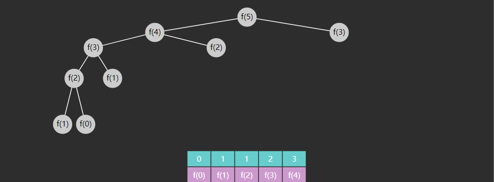

# 03 递归

## 3.1 概述

1. 自己调用自己，解决的是同一类问题
2. 每次调用，函数处理的数据会较上次缩减（子集），而且最后会缩减至无需继续递归
3. 内层函数调用（子集处理）完成，外层函数才能算调用完成

```java
// 例：链表的递归遍历
// 1 -> 2 -> 3 -> null  f(1)

void f(Node node = 1) {
    println("before:" + node.value) // 1
    void f(Node node = 2) {
        println("before:" + node.value) // 2
        void f(Node node = 3) {
            println("before:" + node.value) // 3
            void f(Node node = null) {
                if(node == null) {
                    return;
                }
            }
            println("after:" + node.value) // 3
        }
        println("after:" + node.value) // 2
    }
    println("after:" + node.value) // 1
}
```

**思路**

1. 确定能否使用递归求解
2. 推导出**递推关系**，即父问题与子问题的关系，以及**递归的结束条件**

* 深入到最里层叫做**递**
* 从最里层出来叫做**归**
* 在**递**的过程中，外层函数内的局部变量（以及方法参数）并未消失，**归**的时候还可以用到


## 3.2 单路递归 Single Recursion

### 例1 阶乘

* 递推关系


$$
f(n) = 
\begin{cases}
1 & n = 0, 1\\
n * f(n-1) & n > 1
\end{cases}
$$

```python
def fact(n):
    if n == 1 or n == 0:
        return 1
   	return n * fact(n - 1)
```

### 例2 反向打印字符串

用递归反向打印字符串，n 为字符在整个字符串 str 中的索引位置

* **递**：n 从 0 开始，每次 n + 1，一直递到 n == str.length() - 1
* **归**：从 n == str.length() 开始归，从归打印，因此是逆序的

递推关系
$$
f(n) = 
\begin{cases}
停止 & n = str.length() \\
f(n+1) & 0 \leq n \leq str.length() - 1
\end{cases}
$$

```python
def reverse_print(s, index):
    if index == len(s):
        return
    reverse_print(s, index + 1)
    print(s[index])
```

### 例3 二分查找

```python
def binary_search(a, target):
    return recursion(a, target, 0, len(a)-1)

def recursion(a, target, i, j):
    if i > j:
        return -1
    m = i + j >> 1
    if a[m] > target:
        return recursion(a, target, i, m - 1)
    elif a[m] < target:
        return recursion(a, target, m + 1, j)
    else:
        return m
```

### 例4 冒泡排序

```python
def bubble_sort(a, j):  # j是未排序区域的右边界
    if j == 0:
        return
    for i in range(0, j):
        # 比较i和i+1索引的两个元素
        if a[i] > a[i + 1]:
          tmp = a[i]
          a[i] = a[i + 1]
          a[i + 1] = tmp
    bubble_sort(a, j - 1)
```

优化：设置一个 x 来区分已排序/未排序减少不必要的递归，减小时间复杂度

```python
def bubble_sort2(a, j):
    if j == 0:
        return
    x = 0
    for i in range(0, j):
        if a[i] > a[i + 1]:
          tmp = a[i]
          a[i] = a[i + 1]
          a[i + 1] = tmp
          x = i
    bubble_sort2(a, x)
```

### 例5 插入排序

* 已排序区域：[0 .. i .. low-1]
* 未排序区域：[low .. high->len(a)-1]
* 开始时认为 index=0 是排好序的，因此从 low=1 开始

```python
def insert_sort1(a, low):  # low是未排序区域的左边界
    if low == len(a):
        return
    tmp = a[low]  # 临时变量存储low位置的值用于后续比较
    i = low - 1  # 已排序区域的右边界
    
    # 从右向左找，第一个比tmp小的就是插入位置
    while a[i] > tmp and i >= 0:
        a[i + 1] = a[i]  # 右移一位空出插入位置
        i -= 1
    if i + 1 != low:  # low是被插入区域里最大的时不需要执行插入（不加其实也可以）
        a[i + 1] = tmp  # 插入
    
    insert_sort1(a, low + 1)
```

这种方法更好理解（交换a[i],a[i+1]），但是赋值次数更多，上一种效率更高【时间复杂度还是相同的】

```python
def insert_sort2(a, low):  # low是未排序区域的左边界
    if low == len(a):
        return
    
    i = low - 1
    while i >= 0 and a[i] > a[i + 1]:
        # 交换a[i],a[i+1]
        t = a[i]
        a[i] = a[i + 1]
        a[i + 1] = t
        i -= 1
    
    insert_sort2(a, low - 1)  # 每次保证了最后一位是最大的
```


## 3.3 多路递归 Multi Recursion

如果每个递归函数例包含多个自身调用，称之为 multi recursion

### 例1 斐波那契数列

**递推关系**
$$
f(n) = 
\begin{cases}
0 & n=0 \\
1 & n=1 \\
f(n-1) + f(n-2) & n>1
\end{cases}
$$

**实现**

```python
def fibonacci(n):
    if n == 0:
        return 0
    if n == 1:
        return 1
    return fibonacci(n - 1) + fibonacci(n - 2)
```

**执行流程**


* 绿色代表正在执行（对应递），灰色代表执行结束（对应归）
* 递不到头，不能归，对应着**深度优先搜索 DFS**

**时间复杂度**

* 递归的次数（调用的次数）也符合斐波那契规律，$2 * f(n+1)-1$
* 时间复杂度推导过程
  * 斐波那契通项公式 $f(n) = \frac{1}{\sqrt{5}}*({\frac{1+\sqrt{5}}{2}}^n - {\frac{1-\sqrt{5}}{2}}^n)$，简化为：$f(n) = \frac{1}{2.236}*({1.618}^n - {(-0.618)}^n)$
  * 带入递归次数公式 $2*\frac{1}{2.236}*({1.618}^{n+1} - {(-0.618)}^{n+1})-1$
  * $2*\frac{1}{2.236}$是常数可省略，${(-0.618)}^{n+1}$当 n 很大时 -> 0也可省略，因此化简为${1.618}^{n+1}$
  * 时间复杂度为 $\Theta(1.618^n)$

### **变体1 - 兔子问题**


* 第一个月，有一对未成熟的兔子（黑色，注意图中个头较小）
* 第二个月，它们成熟
* 第三个月，它们能产下一对新的小兔子（蓝色）
* 所有兔子遵循相同规律，求第 $n$ 个月的兔子数

**分析**

兔子问题如何与斐波那契联系起来呢？设第 n 个月兔子数为 $f(n)$

* $f(n)$ = 上个月兔子数 + 新生的小兔子数
* 而【新生的小兔子数】实际就是【上个月成熟的兔子数】，因为需要一个月兔子就成熟，所以【上个月成熟的兔子数】也就是【上上个月的兔子数】
* 上个月兔子数，即 $f(n-1)$
* 上上个月的兔子数，即 $f(n-2)$

因此本质还是斐波那契数列，只是从其第一项开始

### **变体2 - 青蛙爬楼梯** 

* 楼梯有 $n$ 阶
* 青蛙要爬到楼顶，可以一次跳一阶，也可以一次跳两阶
* 只能向上跳，问有多少种跳法

**分析**

| n    | 跳法                                                     | 规律                                                         |
| ---- | -------------------------------------------------------- | ------------------------------------------------------------ |
| 1    | (1)【1】                                                 | 暂时看不出                                                   |
| 2    | (1,1)  (2)【2】                                          | 暂时看不出                                                   |
| 3    | (1,1,1)  (1,2)  (2,1)【3】                               | 暂时看不出                                                   |
| 4    | (1,1,1,1)    (1,2,1)    (2,1,1)<br />(1,1,2)  (2,2)【5】 | 最后一跳，跳一个台阶的，基于 f(3)<br />最后一跳，跳两个台阶的，基于 f(2) |
| 5    | ...                                                      | ...                                                          |

### 例2 汉诺塔问题

**要求**

- 三个石柱从下往上按大小顺序共有64个圆盘，要求通过移动重新摆放在另一个柱子上

* 移动时，一次只能移动一个圆盘且小圆盘上不能放大圆盘

**思路**

* 假设每根柱子标号 a，b，c，每个圆盘用 1，2，3 ... 表示其大小，圆盘初始在 a，要移动到的目标是 c

* 如果只有一个圆盘，此时是最小问题，可以直接求解

  * 移动圆盘1 $a \mapsto c$  

  

* 如果有两个圆盘，那么

  * 圆盘1 $a \mapsto b$ 
  * 圆盘2 $a \mapsto c$
  * 圆盘1 $b \mapsto c$

  

* 如果有三个圆盘，那么

  * 圆盘12 $a \mapsto b$
  * 圆盘3 $a \mapsto c$
  * 圆盘12 $b \mapsto c$

  

* 如果有四个圆盘，那么

  * 圆盘 123 $a \mapsto b$
  * 圆盘4 $a \mapsto c$
  * 圆盘 123 $b \mapsto c$


整体都可以理解为三个步骤：

- 把 $n-1$ 个圆盘由 a 移到 b
- 把圆盘 n 由 a 移到 c
- 把 $n-1$ 个圆盘由 b移到 c

**代码实现**

```python
def init(n):
    for i in range(n, 0, -1):
        a.append(i)

def hanoi(n, a, b, c):
    if n == 0:
        return
    else:
        # step1:把n-1个圆盘a->b
        hanoi(n - 1, a, c, b)
        
        # step2:把最后的盘子a->c
        disk = a.pop()
        c.append(disk)
        print_hanoi()
        
        # step3:把n-1个圆盘b->c
        hanoi(n - 1, b, a, c)

def print_hanoi():
    print("-----------------------")
    print("A:", a)
    print("B:", b)
    print("C:", c)

a = []
b = []
c = []

init(3)
print_hanoi()
hanoi(3, a, b, c)
```

**时间复杂度计算**

$T(n) = 2T(n-1) + c$，$T(1)=c$，不能使用主定理

使用展开法可以得到 $T(n)=(2^{n}-1)c$

因此时间复杂度为 $O(2^n)$【效率非常低】

### 例3 杨辉三角

```
1
1   1
1   2   1
1   3   3   1
1   4   6   4   1
        1
      1   1
    1   2   1
  1   3   3   1
1   4   6   4   1
```

* 行 $i$，列 $j$，那么 $[i][j]$ 的取值应为 $[i-1][j-1] + [i-1][j]$
* 当 $j=0$ 或 $i=j$ 时，$[i][j]$ 取值为 $1$

**递归实现**

```python
def YangHuiTriangle(i, j):  # 行列都从0开始
    if j == 0 or i == j:
        return 1
    return YangHuiTriangle(i - 1, j - 1) + YangHuiTriangle(i - 1, j)

def print_yht(n):
    for i in range(n):
        print(' ' * (n - 1 - i) * 2, end='')
        for j in range(i + 1):
            print(YangHuiTriangle(i, j), end='   ')
        print()
```

**记忆化递归优化**

杨辉三角的创建涉及了多次递归调用，因此用一个二维数组进行记忆化存储

```python
def YangHuiTriangle_memorization(i, j, triangle):
    if triangle[i][j] > 0:
        return triangle[i][j]
    else:
        if j == 0 or i == j:
            triangle[i][j] = 1
            return 1
        triangle[i][j] = YangHuiTriangle_memorization(i - 1, j - 1, triangle) + YangHuiTriangle_memorization(i - 1, j, triangle)
        return triangle[i][j]

def print_yht_memorization(n):
    triangle = [[]] * n  # n行
    for i in range(n):
        triangle[i] = [0] * (i + 1)
        print(' ' * (n - 1 - i) * 2, end='')
        for j in range(i + 1):
            print(YangHuiTriangle_memorization(i, j, triangle), end='   ')
        print()
```

**动态规划 DP**

- 没有使用递归
- 使用上一行来生成下一行

1->3->3->1

1->1+3->3+3->1+3->1+0（自己加上上一个）

```python
def create_row(row, i):
    if i == 0:
        row[0] = 1
        return
    # 生成第i行用的是第i-1行数据
    for j in range(i, 0, -1):  # 每一行的元素个数=最后一个元素下标+1=行号+1
        row[j] = row[j] + row[j - 1]

def print_yht_modify(n):
    row = [0] * n
    for i in range(n):  # 行号i
        create_row(row, i)  # 生成这一行的数据
        print(' ' * (n - 1 - i) * 2, end='')
        for j in range(i + 1):  # 打印每行的元素个数i+1
            print(row[j], end='   ')
        print()
```


## 3.4 递归的讨论

### 1）记忆化递归 Memorization

斐波那契的时间复杂度很高，例如在计算 f(5) 时，f(1), f(0), f(2), f(3) 等被重复计算了多次，因此能否对结果进行记忆，优化时间复杂度呢？


- 考虑用一个数组，用下标存储计算结果，例：index=0 存储 f(0)



```python
def fibonacci_memorization(n):
    # 记忆数组
    cache = [-1] * (n + 1)  # 用-1代表未计算的，因为f(n)的值也会存入，因此开辟n+1个位置
    # 前两项认为是已知的
    cache[0] = 0
    cache[1] = 1
    return f(n, cache)

def f(n, cache):
    if cache[n] != -1:
        return cache[n]
    else:
        x = f(n - 1, cache)
        y = f(n - 2, cache)
        cache[n] = x + y
        return cache[n]
```

**分析**

- 此时的时间复杂度是 $O(n)$
  - 本质上每个 f(n) 都只被执行了一次
- 代价是开辟了额外空间（空间换时间），空间复杂度也是 $O(n)$
- 记忆法是动态规划的一种情况，强调的是自顶向下的解决


### 2）尾递归

**爆栈**

* 每次方法调用是需要消耗一定的栈内存的，这些内存用来存储方法参数、方法内局部变量、返回地址等等
* 方法调用占用的内存需要等到**方法结束时**才会释放
* 而递归在最内层方法没完成之前，外层方法都结束不了

**尾调用**

如果函数的最后一步是调用一个函数，那么称为尾调用

```js
function a(x) {
    return b()  // √
    // 以下情况不能称为尾调用
    const c = b()
    return c  // ×
    return b() + 1  // ×
    return b() + x  // ×
}
```

一些语言（C++，Scala）的编译器能够对尾调用做优化

可以进行优化的主要原因是：由于尾调用的性质，没有需要留给下一函数的东西，返回的结果也由下一函数提供，与当前函数无关，因此当前函数的内存可以释放

```js
// 优化前
function a() {
    // 做前面的事
    return b() 
}
function b() {
    // 做前面的事
    return c()
}
function c() {
    return 1000
}
a()

// 优化后
a()
b()
c()
```

**尾递归**

尾递归是尾调用的一种特例，也就是最后一步执行的是同一个函数

**对于不支持尾递归优化的语言编辑器来说，可以将递归改为循环避免爆栈**

```python
sum = 0
for i in range(1, 100000001):
    sum += i
print(sum)
```


### 3）递归的时间复杂度计算

#### **Master theorem 主定理**

若有递归式
$$
T(n) = aT(\frac{n}{b}) + f(n)
$$
其中 

* $T(n)$ 是问题的运行时间，$n$ 是数据规模
* $a$ 是子问题个数
* $T(\frac{n}{b})$ 是子问题运行时间，每个子问题被拆成原问题数据规模的 $\frac{n}{b}$
* $f(n)$ 是除递归外执行的计算

令 $x = \log_{b}{a}$，即 $x = \log_{子问题缩小倍数}{子问题个数}$

那么
$$
T(n) = 
\begin{cases}
\Theta(n^x) & f(n) = O(n^c) 并且 c \lt x\\
\Theta(n^x\log{n}) & f(n) = \Theta(n^x)\\
\Theta(n^c) & f(n) = \Omega(n^c) 并且 c \gt x
\end{cases}
$$

**例1：**$T(n) = 2T(\frac{n}{2}) + n^4$ 

- 解释：拆成了两个子问题，每个子问题的数据规模是原来的 1/2
- 首先求对数 $x = \log_{2}{2}=1<c=4$，由后者决定整个时间复杂度 $\Theta(n^4)$

**例2：**$T(n) = T(\frac{7n}{10}) + n$

* $a=1, b=\frac{10}{7}, x=0, c=1$
* 此时 $x = 0 < c=1$，由后者决定整个时间复杂度 $\Theta(n)$

**例3：**$T(n) = 16T(\frac{n}{4}) + n^2$

* $a=16, b=4, x=2, c=2$
* 此时 $x=2 = c$，时间复杂度 $\Theta(n^2 \log{n})$

**例4：**$T(n)=7T(\frac{n}{3}) + n^2$

* $a=7, b=3, x=1.?, c=2$
* 此时 $x = \log_{3}{7} < c=2$，由后者决定整个时间复杂度 $\Theta(n^2)$

**例5：**$T(n) = 7T(\frac{n}{2}) + n^2$

* $a=7, b=2, x=2.?, c=2$
* 此时 $x = log_2{7} > c=2$，由前者决定整个时间复杂度 $\Theta(n^{\log_2{7}})$

**例6：**$T(n) = 2T(\frac{n}{4}) + \sqrt{n}$

* $a=2, b=4, x = 0.5, c=0.5$
* 此时 $x = 0.5 = c$，时间复杂度 $\Theta(\sqrt{n}\ \log{n})$

**例7：二分查找递归**

```python
def binary_search(a, target):
    return recursion(a, target, 0, len(a)-1)

def recursion(a, target, i, j):
    if i > j:
        return -1
    m = i + j >> 1
    if a[m] > target:
        return recursion(a, target, i, m - 1)
    elif a[m] < target:
        return recursion(a, target, m + 1, j)
    else:
        return m
```

* 子问题个数 $a = 1$，子问题数据规模缩小倍数 $b = 2$（每次都是在中间值一分为二），除递归外执行的计算是常数级 $c=0$
* 因此递归式为 $T(n) = T(\frac{n}{2}) + n^0$

* 此时 $x=0 = c$，时间复杂度 $\Theta(\log{n})$

**例8：归并排序递归**

```c++
void merge_sort(int q[], int l, int r)
{
    if (l >= r) return;

    int mid = l + r >> 1;
    merge_sort(q, l, mid);
    merge_sort(q, mid + 1, r);

    int k = 0, i = l, j = mid + 1;
    while (i <= mid && j <= r)
        if (q[i] <= q[j]) tmp[k ++ ] = q[i ++ ];
        else tmp[k ++ ] = q[j ++ ];

    while (i <= mid) tmp[k ++ ] = q[i ++ ];
    while (j <= r) tmp[k ++ ] = q[j ++ ];

    for (i = l, j = 0; i <= r; i ++, j ++ ) q[i] = tmp[j];
}
```

* 子问题个数 $a=2$，子问题数据规模缩小倍数 $b=2$，除递归外，主要时间花在合并上，它可以用 $f(n) = n$ 表示
* 因此递归式为 $T(n) = 2T(\frac{n}{2}) + n$

* 此时 $x=1=c$，时间复杂度 $\Theta(n\log{n})$

**例9：快速排序递归**

```c++
void quick_sort(int q[], int l, int r)
{
    if (l >= r) return;

    int i = l - 1, j = r + 1, x = q[l + r >> 1];
    while (i < j)
    {
        do i ++ ; while (q[i] < x);
        do j -- ; while (q[j] > x);
        if (i < j) swap(q[i], q[j]);
    }
    quick_sort(q, l, j), quick_sort(q, j + 1, r);
}
```

* 子问题个数 $a=2$
* 子问题数据规模缩小倍数
  * **这里不一定取到中间点**
  * 如果分区分的好，$b=2$（正好一半一半）
  * 如果分区没分好，例如分区1 的数据是 0，分区 2 的数据是 $n-1$
* 除递归外，主要时间花在分区上，它可以用 $f(n) = n$ 表示

情况1 - 分区分的好

$T(n) = 2T(\frac{n}{2}) + n$

* 此时 $x=1=c$，时间复杂度 $\Theta(n\log{n})$

情况2 - 分区没分好

$T(n) = T(n-1) + T(1) + n$

* 此时不能用主定理求解


#### 展开求解

**例1：递归求和**

```python
def sum(n):
    if n == 1:
        return 1
    return n + sum(n - 1)
```

$T(n) = T(n-1) + c$，$T(1) = c$

下面为展开过程

$T(n) = T(n-2) + c + c$

$T(n) = T(n-3) + c + c + c$

...

$T(n) = T(n-(n-1)) + (n-1)c=T(1)+(n-1)c=nc$ 

因此，时间复杂度为 $O(n)$

**例2：递归冒泡排序**

```python
def bubble_sort(a, j):  # j是未排序区域的右边界
    if j == 0:
        return
    for i in range(0, j):
        # 比较i和i+1索引的两个元素
        if a[i] > a[i + 1]:
          tmp = a[i]
          a[i] = a[i + 1]
          a[i + 1] = tmp
    bubble_sort(a, j - 1)
```

$T(n) = T(n-1) + n$，$T(1) = c$

下面为展开过程

$T(n) = T(n-2) + (n-1) + n$

$T(n) = T(n-3) + (n-2) + (n-1) + n$

...

$T(n) = T(1) + 2 + ... + n = T(1) + (n-1)\frac{2+n}{2} = c + \frac{n^2}{2} + \frac{n}{2} -1$

因此，时间复杂度 $O(n^2)$

**例3：递归快速排序**

```c++
void quick_sort(int q[], int l, int r)
{
    if (l >= r) return;

    int i = l - 1, j = r + 1, x = q[l + r >> 1];
    while (i < j)
    {
        do i ++ ; while (q[i] < x);
        do j -- ; while (q[j] > x);
        if (i < j) swap(q[i], q[j]);
    }
    quick_sort(q, l, j), quick_sort(q, j + 1, r);
}
```

快速排序分区没分好的极端情况

$T(n) = T(n-1) + T(1) + n$，$T(1) = c$

$T(n) = T(n-1) + c + n$

下面为展开过程

$T(n) = T(n-2) + c + (n-1) + c + n$

$T(n) = T(n-3) + c + (n-2) + c + (n-1) + c + n$

...

$T(n) = T(n-(n-1)) + (n-1)c + 2+...+n = \frac{n^2}{2} + \frac{2cn+n}{2} -1$

因此，时间复杂度 $O(n^2)$


## 练习

#### [70. 爬楼梯](https://leetcode.cn/problems/climbing-stairs/description/)

- 斐波那契数列的记忆化优化

#### [118. 杨辉三角](https://leetcode.cn/problems/pascals-triangle/)

- 动态规划（同时注意到杨辉三角每行的回文特性，因此不用倒着生成）

```python
def generate(self, numRows: int) -> List[List[int]]:
    res = [[1]]
    for i in range(1, numRows):
        data = [1]
        for j in range(1, i + 1):
            try:
                data.append(res[i - 1][j - 1] + res[i - 1][j])
                except IndexError:
                    data.append(res[i - 1][j - 1])
                    res.append(data)
                    return res
```

#### [119. 杨辉三角 II](https://leetcode.cn/problems/pascals-triangle-ii/)

- 动态规划【时间复杂度：$O(rowIndex^2)$，空间复杂度：$O(rowIndex)$】

```python
def getRow(self, rowIndex: int) -> List[int]:
    res = []
    for i in range(0, rowIndex + 1):
        res.append(1)  # 每一行的最后一定是1
        # 按上一行的结果倒着生成这一行
        for j in range(i-1, 0, -1):
            res[j] = res[j] + res[j - 1]
            return res
```

