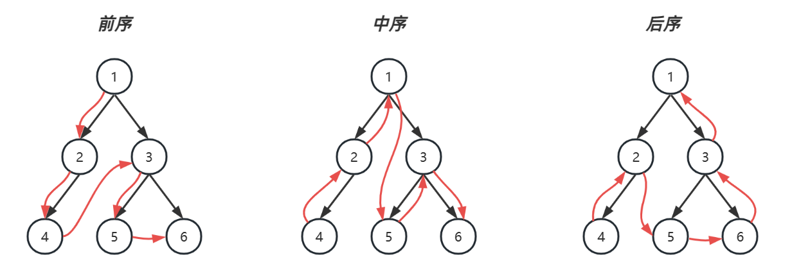

# 05 二叉树

## 5.1 定义

二叉树是一种树状结构：每个节点最多有两个孩子，左孩子和右孩子；没有孩子的节点称为**叶节点**；起始节点称为**根节点**

重要的二叉树结构

* **完全二叉树（complete binary tree）**是一种二叉树结构，除最后一层以外，每一层都必须填满，填充时要遵从先左后右
* **平衡二叉树（balance binary tree）**是一种二叉树结构，其中每个节点的左右子树高度相差不超过 1


## 5.2 二叉树的存储

存储方式分为两种

1. 定义树节点与左、右孩子引用（TreeNode）
2. 使用数组，若以 0 作为树的根，索引可以通过如下方式计算【类似堆】
   * 父 = floor((子 - 1) / 2)
   * 左孩子 = 父 * 2 + 1
   * 右孩子 = 父 * 2 + 2


## 5.3 二叉树的遍历

### BFS（广度优先遍历）

尽可能先访问距离根最近的节点，也称为层序遍历


**队列实现**

1. 初始化，将根节点加入队列
2. 循环处理队列中每个节点，直至队列为空
3. 每次循环内处理节点后，将它的孩子节点（即下一层的节点）加入队列

> 注意
>
> * 以上用队列来层序遍历是针对  TreeNode 这种方式表示的二叉树
> * 对于数组表现的二叉树，则直接遍历数组即可，自然为层序遍历的顺序

[102. 二叉树的层序遍历](https://leetcode.cn/problems/binary-tree-level-order-traversal/)

```python
class Solution:
    def levelOrder(self, root):
        if root is None:
            return []
        res = []
        queue = [root]  # 根节点初始入队 
        while queue:
            one_level_list = []  # 存一层内的值
            num = len(queue)  # 该层有几个不是None的节点
            for i in range(num):
                node = queue.pop(0)
                one_level_list.append(node.val)
                if node.left:
                    queue.append(node.left)
                if node.right:
                    queue.append(node.right)
            res.append(one_level_list)
        return res
```

### DFS（深度优先遍历）

1. pre-order 前序遍历，先访问该节点，然后是左子树，最后是右子树
2. in-order 中序遍历，先访问左子树，然后是该节点，最后是右子树
3. post-order 后序遍历，先访问左子树，然后是右子树，最后是该节点



#### 递归实现

```python
def pre_order(node):
    if node == None:
        return
    print(node.val, end=' ')
    pre_order(node.left)
    pre_order(node.right)
    
def in_order(node):
    if node == None:
        return
    in_order(node.left)
    print(node.val, end=' ')
    in_order(node.right)

def post_order(node):
    if node == None:
        return
    post_order(node.left)
    post_order(node.right)
    print(node.val, end=' ')
```

==无论哪种遍历，走的路是一样的，用栈来记录父节点==

#### 非递归实现

```python
# 前序与中序
stack = []
cur = root  # 当前节点
while cur or stack:
    if cur:
        print('去', cur.val)  # 前序
        stack.append(cur)
        cur = cur.left
    else:
        pop = stack.pop()
        print('回', pop.val)  # 中序
        cur = pop.right
```

对于后序遍历，向回走时，需要处理完右子树才能 pop 出栈。如何知道右子树处理完成呢？

* 如果栈顶元素的 $right== None$ 表示没有右子树，可以出栈

* 如果栈顶元素的 $right \neq None$，

    * 那么使用 lastPop 记录最近出栈的节点，即表示从这个节点向回走
    * 如果栈顶元素的 $right==lastPop$ 此时应当出栈


对于前、中两种遍历，实际从右子树向回走时，并未走完全程（stack 提前出栈了，直接到了上一层），后序遍历则是走完全程了

```python
# 后序
stack = []
pop = None  # 最近一次弹栈的元素
cur = root  # 当前节点
while cur or stack:
    if cur:
        stack.append(cur)
        cur = cur.left
    else:
        # 获取栈顶元素
        peek = stack[len(stack) - 1]
        # 判断右子树是否处理完成
        if peek.right == None or peek.right == pop:  # 本身没有右子树 or 右子树是上一个弹栈的
            pop = stack.pop()
            print(pop.val, end=' ')
        else:
            cur = peek.right
```

#### 统一写法（非递归）

```python
stack = []
pop = None  # 最近一次弹栈的元素
cur = root  # 当前节点
while cur or stack:
    if cur:
        stack.append(cur)
        # print(cur.val, end=' ')  # 前序(在处理左前输出)
        # 待处理左子树
        cur = cur.left
    else:
        peek = stack[len(stack) - 1]
        # 本身没有右子树
        if peek.right == None:
            print(stack[len(stack) - 1].val, end=' ')  # 中序(在处理完左 且 没有右时输出) 
            pop = stack.pop()
            # print(pop.val, end=' ')  # 后序(在处理完左/没有右后输出)
        # 右子树处理完成
        elif peek.right == pop:
            pop = stack.pop()
            # print(pop.val, end=' ')  # 后序(在处理完左/没有右后输出)
        # 待处理右子树
        else:
            print(stack[len(stack) - 1].val, end=' ')  # 中序(在处理完左 且 未开始处理右时输出)
            cur = peek.right
```


## 习题

#### [102. 二叉树的层序遍历](https://leetcode.cn/problems/binary-tree-level-order-traversal/)

#### [144. 二叉树的前序遍历](https://leetcode.cn/problems/binary-tree-preorder-traversal/)

#### [94. 二叉树的中序遍历](https://leetcode.cn/problems/binary-tree-inorder-traversal/)

#### [145. 二叉树的后序遍历](https://leetcode.cn/problems/binary-tree-postorder-traversal/)

#### [101. 对称二叉树](https://leetcode.cn/problems/symmetric-tree/)

- BFS+比较每层是否对称【时空复杂度均为$O(n)$】
- 递归

#### [100. 相同的树](https://leetcode.cn/problems/same-tree/)

- BFS 依次比较每个元素
- 递归

#### [104. 二叉树的最大深度](https://leetcode.cn/problems/maximum-depth-of-binary-tree/)

- DFS 后序（递归版）
    - 先求左子树深度，再求右子树深度，取两者较大值+1【要加上本层的深度】
- DFS 后序（非递归版）
    - 栈的元素个数 = 最大深度，在每次压栈时更新深度
- BFS
    - 每遍历一层都使深度 depth += 1

#### [111. 二叉树的最小深度](https://leetcode.cn/problems/minimum-depth-of-binary-tree/)

- DFS 后序（递归版）
    - 先求左子树深度，再求右子树深度，取两者较大值+1【要加上本层的深度】
    - 同时如果出现子树为 None 的情况，其实是不算深度的，直接返回 depth1 + depth 2 + 1
- BFS
    - 遇到的第一个叶子节点的深度就是最小深度
    - 只要找到叶子节点就结束遍历，因此效率更高

#### [226. 翻转二叉树](https://leetcode.cn/problems/invert-binary-tree/)

- 递归

#### [105. 从前序与中序遍历序列构造二叉树](https://leetcode.cn/problems/construct-binary-tree-from-preorder-and-inorder-traversal/)

preorder = [1,2,4,3,6,7]

inorder = [4,2,1,6,3,7]

- 前序确定了 root
- 中序可以借助 root 划分左右子树
- 递归调用：根据前一个 root 确定下一次递归的 pre_order 和 in_order

#### [106. 从中序与后序遍历序列构造二叉树](https://leetcode.cn/problems/construct-binary-tree-from-inorder-and-postorder-traversal/)

思路与上一题类似，都是先找 root，随后划分左右子树，最后用新的 in_order 和 post_order 递归调用


# 06 二叉搜索树 BST

## 6.1 概述

二叉搜索树（binary search/sorted tree，简称 BST）

BST 是符合下面特征的二叉树：

1. 树节点增加 key 属性，用来比较谁大谁小，key 不可以重复
2. 对于任意一个树节点，它的 key 比左子树的 key 都大，同时也比右子树的 key 都小


轻易看出要查找 7 （从根开始）自然就可应用**二分查找**算法，只需三次比较

* 与 4 比，较之大，向右找
* 与 6 比，较之大，继续向右找
* 与 7 比，找到

查找的时间复杂度与**树高**相关，插入、删除也是如此。

* 如果这棵树长得还不赖（左右平衡）上图，那么时间复杂度均是 $O(\log{n})$
* 当然，这棵树如果长得丑（左右高度相差过大，如下图），在最糟的情况，时间复杂度是 $O(n)$【此种极限情况下类似链表】


## 6.2 BST的实现

### 节点定义

```python
class BSTNode:
    def __init__(self, key, value=None, left=None, right=None):
        self.key = key
        self.value = value
        self.left = left
        self.right = right
```

### 查询（递归）

```python
# 查找关键字对应的值(递归版)
def get_recursion(self, key):
    return self.do_get(self.root, key)

def do_get(self, node, key):
    # 每次找的逻辑是相同的，因此封装递归
    if not node:
        return None  # 没找到
    if key < node.key:  # 向左找
        return self.do_get(node.left, key)
    elif key > node.key:  # 向右找
        return self.do_get(node.right, key)
    else:
        return node.value
```

### 查询（非递归）

```python
# 查找关键字对应的值(非递归版)
def get_norecur(self, key):
    node = self.root
    while node:
        if key < node.key:
            node = node.left
        elif key > node.key:
            node = node.right
        else:
            return node.value
    return None
```

### **查找最大/最小关键字**

```python
def min_recursion(self):
    return self.do_min(self.root)

def do_min(self, node):
    if node is None:
        return None
    if node.left is None:
        return node.value
    return self.do_min(node.left)

def min_norecur(self):
    if self.root is None:
        return None
    node = self.root
    while node.left:
        node = node.left
    return node.value
```

### 新增

```python
def put(self, key, value):
    # 查找是否已经在BST中
    parent = None  # 记录父节点
    node = self.root
    while node:
        parent = node
        if key < node.key:
            node = node.left
        elif key > node.key:
            node = node.right
        else:
            # 相当于找到了, 进行key的替换
            node.value = value
            return 
    # 没有找到
    node = BSTNode(key, value)
    if parent is None:  # 树为空时
        self.root = node
        return
    if key < parent.key:
        parent.left = node
    else:  # 不可能相等
        parent.right = node
```

### 前驱

一个节点的前驱（前任）节点是指比它小的节点中，最大的那个

一个节点的后继（后任）节点是指比它大的节点中，最小的那个

方法1：中序遍历，可以得到key的升序排列

- 两个指针记录当前与前一个，性能不高，最差情况 $O(n)$

方法2：

- 情况1：节点有左子树，此时前驱节点就是左子树的最大值
- 情况2：节点没有左子树，此时前驱节点是其祖先节点中第一个比它小的节点

```python
def predecessor(self, key):
    ancestor_left = None
    p = self.root
    while p:
        if key < p.key:
            p = p.left
        elif key > p.key:
            ancestor_left = p
            p = p.right  # 代表祖先自左而来
        else:
            break
    # 如果没找到，那肯定不存在前驱
    if p is None:
        return None
    # 下面是找到的情况
    # 情况1：节点有左子树，此时前驱节点就是左子树的最大值
    if p.left:
        return self.do_max(p.left)
    # 情况2：节点没有左子树，此时前驱节点是其祖先节点中第一个比它小的节点
    return ancestor_left.value if ancestor_left else None
```

### 后继

- 情况1：节点有右子树，此时后继节点即为右子树的最小值
- 情况2：节点没有右子树，若离它最近的祖先自从右而来，此祖先即为后继

```python
def successor(self, key):
    ancestor_right = None
    p = self.root
    while p:
        if key < p.key:
            ancestor_right = p
            p = p.left  # 代表祖先自右而来
        elif key > p.key:
            p = p.right  
        else:
            break
    # 如果没找到，那肯定不存在后继
    if p is None:
        return None
    # 下面是找到的情况
    # 情况1：节点有右子树，此时后继节点即为右子树的最小值
    if p.left:
        return self.do_min(p.right)
    # 情况2：节点没有右子树，若离它最近的祖先自从右而来，此祖先即为后继
    return ancestor_right.value if ancestor_right else None
```

### 删除（非递归）

要删除某节点（称为 D），必须先找到被删除节点的父节点，这里称为 Parent

1. 删除节点没有左孩子，将右孩子托孤给 Parent
2. 删除节点没有右孩子，将左孩子托孤给 Parent
3. 删除节点左右孩子都没有，已经被涵盖在情况1、情况2 当中，把 None 托孤给 Parent
4. 删除节点左右孩子都有，可以将它的后继节点（称为 S）托孤给 Parent，设 S 的父亲为 SP，又分两种情况【★】
    1. SP 就是被删除节点，此时 D 与 S 紧邻，只需将 S 托孤给 Parent
    2. SP 不是被删除节点，此时 D 与 S 不相邻，此时需要将 S 的后代托孤给 SP，再将 S 托孤给 Parent

```python
def delete(self, key):
    # 先找到待删除节点并记录parent
    parent = None
    p = self.root
    while p:
        if key < p.key:
            parent = p
            p = p.left
        elif key > p.key:
            parent = p
            p = p.right
        else:
            break
    # 如果没找到，那没法删除
    if p is None:
        return None
    # 执行删除操作
    # 情况1：删除节点没有左孩子
    if p.left == None:
        self.shift(parent, p, p.right)
    # 情况2：删除节点没有右孩子
    elif p.left != None:
        self.shift(parent, p, p.left)
    # 情况3：删除节点没有孩子(已包含在情况1/情况2中)
    # 情况4：删除节点有左右孩子
    else:
        # 1 (在右子树中)找被删除节点的后继节点
        s = p.right  # 后继节点
        sparent = p  # 后继节点的父节点
        while s.left:
            sparent = s
            s = s.left
        # 2 如果删除节点和后继节点不相邻，需要处理后继节点的后事(右子树)
        # 做的操作其实就是删除后继节点
        if sparent != p:
            self.shift(sparent, s, s.right)  # 一定是s.right，否则s不是后继
        # 3 后继取代被删除节点
        self.shift(parent, p, s)
        s.left = p.left  # 考虑顶上去节点的左子树
    return p.value
        
# 托孤
def shift(self, parent, deleted, child):
    if parent is None:
        self.root = child
    elif deleted == parent.left:
        parent.left = child
    elif deleted == parent.right:
        parent.right = child
```

### 删除（递归）【没懂】

```python
# 删除(递归)
def delete_recursion(self, key):
    result = []  # 保存被删除节点的值
    self.root = self.do_delete(self.root, key, result)
    if result:
        return result[0]
    return None

def do_delete(self, node, key, result):
    # node -> 起点
    # return -> 删剩下的孩子 or None
    if node is None:
        return None
    if key < node.key:
        node.left = self.do_delete(node.left, key, result)
        return node
    if key > node.key:
        node.right = self.do_delete(node.right, key, result)
        return node
    result.append(node.value)
    # 情况1：只有右孩子
    if node.left is None:
        return node.right
    # 情况2：只有左孩子
    if node.right is None:
        return node.left
    # 情况3：两个孩子
    # 找后继节点
    s = node.right
    while node.left:
        s = s.left
    # 处理不相邻的情况
    s.right = self.do_delete(node.right, s.key, [])
    s.left = node.left
    return s
```

### 范围查询

需求：

- 找所有比 key 小的 value
- 找所有比 key 大的 value
- 找 >= key1 & <= key2的所有 value

思路：利用 BST 的中序遍历结果为递增的特性

```python
# 找所有比 key 小的 value、
def less(self, key):
    result = []
    p = self.root
    stack = []
    while p or stack:
        if p:
            stack.append(p)
            p = p.left
        else:
            pop = stack.pop()
            # 处理值
            if pop.key < key:
                result.append(pop.value)
            else:
                break
            p = pop.right
    return result

# 找所有比 key 大的 value
def greater(self, key):
    result = []
    p = self.root
    stack = []
    while p or stack:
        if p:
            stack.append(p)
            p = p.left
        else:
            pop = stack.pop()
            # 处理值
            if pop.key > key:
                result.append(pop.value)
            p = pop.right
    return result

# 找 >= key1 & <= key2的所有 value
def between(self, key1, key2):
    result = []
    p = self.root
    stack = []
    while p or stack:
        if p:
            stack.append(p)
            p = p.left
        else:
            pop = stack.pop()
            # 处理值
            if pop.key <= key2 and pop.key >= key1:
                result.append(pop.value)
            if pop.key > key2:
                break
            p = pop.right
    return result
```

注：对于 greater，可以改为“右值左”的方式进行遍历【反向中序遍历】

```python
# 找所有比 key 大的 value(update 反中序遍历)
def greater_update(self, key):
    result = []
    p = self.root
    stack = []
    while p or stack:
        if p:
            stack.append(p)
            p = p.right
        else:
            pop = stack.pop()
            # 处理值
            if pop.key > key:
                result.append(pop.value)
            else:
                break
            p = pop.left
    return result
```


## 习题

#### [700. 二叉搜索树中的搜索](https://leetcode.cn/problems/search-in-a-binary-search-tree/)

非常基础

#### [701. 二叉搜索树中的插入操作](https://leetcode.cn/problems/insert-into-a-binary-search-tree/)

非常基础
